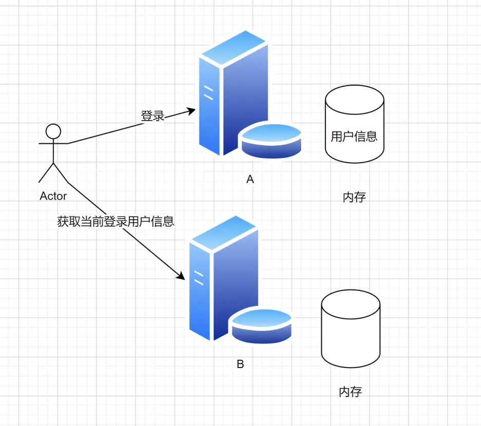
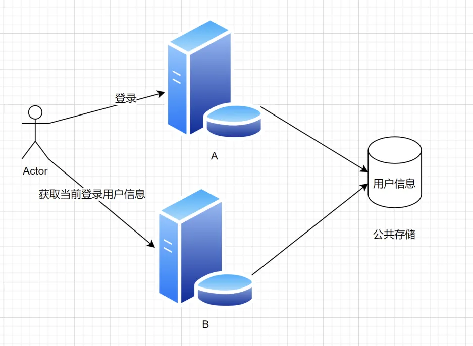

#  雨伞租借系统（移动端的H5网页）

介绍：雨伞共享租借，移动端 H5 网页（尽量兼容 PC 端）


# 项目结构

├─main（src的main主目录）
│  ├─java
│  │  └─com
│  │      └─fishman
│  │          │  SoftwareProjectApplication.java（项目入口）
│  │          │  
│  │          ├─annotation
│  │          │      AuthCheck.java（权限校验）
│  │          │      
│  │          ├─aop（aop切面，通过反射拿到用户信息）
│  │          │      AuthInterceptor.java
│  │          │      LogInterceptor.java
│  │          │      
│  │          ├─common（通用类）
│  │          │      BaseResponse.java（基本返回码）
│  │          │      DeleteRequest.java（删除请求）
│  │          │      ErrorCode.java（错误码）
│  │          │      PageRequest.java（页面请求）
│  │          │      ResultUtils.java（返回工具类）
│  │          │      
│  │          ├─config（配置类）
│  │          │      DruidConfig.java（后台数据源监控）
│  │          │      HttpSessionConfig.java（http通信类）
│  │          │      MybatisPlusConfig.java（mybatispuls配置类）
│  │          │      RedissonConfig.java（redis初始化）
│  │          │      RedisTemplateConfig.java（redis客户端）
│  │          │      SwaggerConfig.java（swagger文档配置）
│  │          │      WebMvcConfig.java（解决web跨域）
│  │          │      
│  │          ├─constant（常量）
│  │          │      CommonConstant.java（通用常量）
│  │          │      FileConstant.java（文件常量）
│  │          │      UserConstant.java（用户常量）
│  │          │      
│  │          ├─controller（接口）
│  │          │      CommentServiceController.java（评论接口）
│  │          │      GoodsController.java（商品接口）
│  │          │      OrderController.java（订单接口）
│  │          │      UserController.java（用户接口）
│  │          │      
│  │          ├─exception（异常码）
│  │          │      BusinessException.java（自定义异常类）
│  │          │      GlobalExceptionHandler.java（全局异常处理器）
│  │          │      ThrowUtils.java（抛异常的工具类）
│  │          │      
│  │          ├─mapper（数据库的mapepr映射）
│  │          │      CommentMapper.java（评论）
│  │          │      CurrentUserMapper.java（当前用户）
│  │          │      GoodsMapper.java（商品）
│  │          │      OrderMapper.java（订单）
│  │          │      ProfitMapper.java（收益计算）
│  │          │      UserMapper.java（用户）
│  │          │      
│  │          ├─model（模型）
│  │          │  ├─dto（封装的传输请求）
│  │          │  │  ├─file（文件类）
│  │          │  │  │      UploadFileRequest.java（文件上传请求）
│  │          │  │  │      
│  │          │  │  ├─umbrellas（雨伞请求）
│  │          │  │  │      UmbrellasAddRequest.java（添加）
│  │          │  │  │      UmbrellasQueryRequest.java（列表）
│  │          │  │  │      UmbrellasRentRequest.java（租借）
│  │          │  │  │      UmbrellasUpdateMyRequest.java（更新）
│  │          │  │  │      
│  │          │  │  └─user（用户请求）
│  │          │  │          UserAddRequest.java（增加）
│  │          │  │          UserLoginRequest.java（登录）
│  │          │  │          UserQueryRequest.java（列表）
│  │          │  │          UserRegisterRequest.java（注册）
│  │          │  │          UserUpdateMyRequest.java（更新）
│  │          │  │          UserUpdateRequest.java（更新（管理员））
│  │          │  │          
│  │          │  ├─entity（实体类）
│  │          │  │      Comment.java（评论）
│  │          │  │      CurrentUser.java（当前用户）
│  │          │  │      Goods.java（商品）
│  │          │  │      Order.java（订单）
│  │          │  │      Profit.java（利润）
│  │          │  │      User.java（用户）
│  │          │  │      
│  │          │  ├─enums（枚举类）
│  │          │  │      FileUploadBizEnum.java（文件上传）
│  │          │  │      UserRoleEnum.java（用户角色）
│  │          │  │      
│  │          │  └─vo（封装传输信息，脱敏）
│  │          │          LoginUserVO.java（登录信息）
│  │          │          UmbrellasVO.java（雨伞信息）
│  │          │          UserVO.java（用户信息）
│  │          │          
│  │          ├─service（服务层）
│  │          │      CommentService.java（评论功能）
│  │          │      CurrentUserService.java（当前用户功能）
│  │          │      GoodsService.java（商品功能）
│  │          │      OrderService.java（支付功能）
│  │          │      ProfitService.java（利润功能）
│  │          │      UserService.java（用户功能）
│  │          │      
│  │          ├─utils（工具类）
│  │          │      EncoderUtil.java（加密工具）
│  │          │      JWTUtil.java（token生成工具）
│  │          │      Message.java（相应信息返回工具）
│  │          │      NetUtils.java（记录用户ip工具）
│  │          │      SpringContextUtils.java（获取bean工具）
│  │          │      SqlUtils.java（校验sql字段是否合法，防止sql注入）
│  │          │      
│  │          └─wxmp（微信扫码小工具）
│  │              │  WxMpConstant.java
│  │              │  WxMpMsgRouter.java
│  │              │  
│  │              └─handler
│  │                      EventHandler.java
│  │                      MessageHandler.java
│  │                      SubscribeHandler.java
│  │                      
│  └─resources
│          application.yml（配置文件）
│          banner.txt
│          
└─test（测试类）
    └─java
        └─com
            └─fishman
                │  SoftwareProjectApplicationTests.java
                │  
                ├─config
                │      DruidConfigTest.java
                │      
                ├─mapper
                │      CurrentUserMapperTest.java
                │      GoodsMapperTest.java
                │      
                ├─service
                │      GoodsServiceTest.java
                │      UserServiceTest.java
                │      
                └─utils
                        JWTUtilTest.java
                        

## 技术栈

### 前端

1. Vue 2 开发框架（提高页面开发的效率）

### 后端

1. Java 编程语言 + SpringBoot 框架
2. SpringMVC + MyBatis + MyBatis Plus（提高开发效率）
3. MySQL 数据库
4. Redis 缓存
5. Swagger + Knife4j 接口文档

# 前端

1. 前端整合路由 
2. 前端开发（搜索页面、用户信息页、用户信息修改页）
3. 后端整合 Swagger + Knife4j 接口文档 


# 后端整合 Swagger + Knife4j 接口文档

什么是接口文档？写接口信息的文档，每条接口包括：

- 请求参数
- 响应参数
- 错误码
- 接口地址
- 接口名称
- 请求类型
- 请求格式
- 备注

who 谁用？一般是后端或者负责人来提供，后端和前端都要使用

为什么需要接口文档？

- 有个书面内容（背书或者归档），便于大家参考和查阅，便于 **沉淀和维护** ，拒绝口口相传
- 接口文档便于前端和后端开发对接，前后端联调的 **介质** 。后端 => 接口文档 <= 前端
- 好的接口文档支持在线调试、在线测试，可以作为工具提高我们的开发测试效率

怎么做接口文档？

- 手写（比如腾讯文档、Markdown 笔记）
- 自动化接口文档生成：自动根据项目代码生成完整的文档或在线调试的网页。Swagger，Postman（侧重接口管理）（国外）；apifox、apipost、eolink（国产）

接口文档有哪些技巧？

Swagger 原理：

1. 引入依赖（Swagger 或 Knife4j：https://doc.xiaominfo.com/knife4j/documentation/get_start.html）
2. 自定义 Swagger 配置类
3. 定义需要生成接口文档的代码位置（Controller）
4. 千万注意：线上环境不要把接口暴露出去！！！可以通过在 SwaggerConfig 配置文件开头加上 @Profile({"dev", "test"}) 限定配置仅在部分环境开启
5. 启动即可
6. 可以通过在 controller 方法上添加 @Api、@ApiImplicitParam(name = "name",value = "姓名",required = true) @ApiOperation(value = "向客人问好") 等注解来自定义生成的接口描述信息

如果 springboot version >= 2.6，需要添加如下配置：

```yaml
spring:
  mvc:
    pathmatch:
      matching-strategy: ant_path_matcher
```

可以通过在 controller 方法上添加 @Api、@ApiImplicitParam(name = "name",value = "姓名",required = true) @ApiOperation(value = "向客人问好") 等注解来自定义生成的接口描述信息。

千万注意：线上环境不要把接口暴露出去！！！可以通过在 SwaggerConfig 配置文件开头加上 @Profile({"dev", "test"}) 限定配置仅在部分环境开启

knife4j对比swagger来说，虽然可视化增强了，但是不能进行接口管理

# 分布式 session

种 session 的时候注意范围，cookie.domain

比如两个域名：

aaa.yupi.com

bbb.yupi.com

如果要共享 cookie，可以种一个更高层的公共域名，比如 yupi.com

### 为什么服务器 A 登录后，请求发到服务器 B，不认识该用户？

用户在 A 登录，所以 session（用户登录信息）存在了 A 上

结果请求 B 时，B 没有用户信息，所以不认识。



解决方案



## Session 共享实现使用Redis

如何共享存储？

1. Redis（基于内存的 K / V 数据库）此处选择 Redis，因为用户信息读取 / 是否登录的判断极其**频繁** ，Redis 基于内存，读写性能很高，简单的数据单机 qps 5w - 10w
2. MySQL 
3. 文件服务器 ceph


 官网：https://redis.io/

redis 管理工具 quick redis：https://quick123.net/

Redis 5.0.14 下载：

链接：https://pan.baidu.com/s/1XcsAIrdeesQAyQU2lE3cOg

提取码：vkoi 

1. 引入 redis，能够操作 redis：

# Redis 缓存

## 数据查询慢怎么办？

用缓存：提前把数据取出来保存好（通常保存到读写更快的介质，比如内存），就可以更快地读写。

1. 引入

```xml
 <dependency>           <groupId>org.springframework.boot</groupId>
    <artifactId>spring-boot-starter-data-redis</artifactId>
     <version>2.6.4</version>
</dependency>
```

这里面整合了sprin-data-redis的操作包和letture操作redis的客户端接口

2. 配置（application.yml）

```yaml
  #redis配置
  redis:
    port: 6379
    host: localhost
    database: 0
```

3. 设置反序列化

```java
package com.yupi.usercenter.config;
import org.springframework.context.annotation.Bean;
import org.springframework.context.annotation.Configuration;
import org.springframework.data.redis.connection.RedisConnectionFactory;
import org.springframework.data.redis.core.RedisTemplate;
import org.springframework.data.redis.serializer.GenericJackson2JsonRedisSerializer;
import org.springframework.data.redis.serializer.RedisSerializer;

/**
 *
 *  自定义序列化
 *
 */
@Configuration
public class RedisTemplateConfig {

    @Bean
    public RedisTemplate<String, Object> redisTemplate(RedisConnectionFactory connectionFactory) {
        //创建RedisTemplate对象
        RedisTemplate<String, Object> redisTemplate = new RedisTemplate<>();
       //设置连接工厂
        redisTemplate.setConnectionFactory(connectionFactory);
        //设置Key的序列化
        redisTemplate.setKeySerializer(RedisSerializer.string());
        //创建Json序列化工具
        GenericJackson2JsonRedisSerializer jsonRedisSerializer = new GenericJackson2JsonRedisSerializer();
        //设置Value的序列化
        redisTemplate.setValueSerializer(jsonRedisSerializer);

        return redisTemplate;
    }
}
```

### 缓存

- Redis（分布式缓存）
- memcached（分布式）
- Etcd（云原生架构的一个分布式存储，**存储配置**，扩容能力）
- ehcache（单机）
- 本地缓存（Java 内存 Map）
- Caffeine（Java 内存缓存，高性能）
- Google Guava
- 理论上mq应该也能做缓存


## 实现方式

- Spring-Data-Redis（实现类）
- Spring Data：

- - 通用的数据访问框架，定义了一组 增删改查 的接口mysql、redis、jpa（说实话比mybatis更加抽象）

- Jedis：	

- - (独立于 Spring 操作 Redis 的 Java 客户端，要配合 Jedis Pool 使用)

- Lettuce

- - **高阶** 的操作 Redis 的 Java 客户端
  - 异步、连接池

- Redisson

- - 分布式操作 Redis 的 Java 客户端，让你像在使用本地的集合一样操作 Redis（分布式 Redis 数据网格）

## 对比

1. 如果你用的是 Spring，并且没有过多的定制化要求，可以用 Spring Data Redis，最方便
2. 如果你用的不是 SPring，并且追求简单，并且没有过高的性能要求，可以用 Jedis + Jedis Pool
3. 如果你的项目不是 Spring，并且追求高性能、高定制化，可以用 Lettuce，支持异步、连接池


- 如果你的项目是分布式的，需要用到一些分布式的特性（比如分布式锁、分布式集合），推荐用 redisson


### Redis

NoSQL 数据库

准确的定义是key - value 存储系统（区别于 MySQL，存储的是键值对），不光可以用来像数据库一样存储数据，可以做缓存，也可以做消息队列


# 数据缓存

### 设计缓存 的rediskey

不同用户看到的数据不同

systemId:moduleId:func:options（不要和别人冲突）

我设置为

```java
String redisKey = String.format("fishman:user:recommend:%s",logininUser.getId());
```

fishman:user:recommed:userId

## redis 内存不能无限增加，一定要设置过期时间！！！

## 必要的时候还要设置淘汰策略，万一出事了就寄了！！！

```java
try {
            valueOperations.set(redisKey,userPage,30000, TimeUnit.MILLISECONDS);
        } catch (Exception e){
            log.error("redis set key error",e);
        }
```


# 定时任务/数据预热

问题：第一个用户访问还是很慢（加入第一个老板），也能一定程度上保护数据库

缓存预热的优点：

1. 解决上面的问题，可以让用户始终访问很快

缺点：

1. 增加开发成本（你要额外的开发、设计）
2. 预热的时机和时间如果错了，有可能你缓存的数据不对或者太老
3. 需要占用额外空间（全部预热容易爆炸！最好做一个内存和用户访问的统计，对特定的数据和页面进行预热）

#### 怎么缓存预热？

1. 定时
2. 模拟触发（手动触发）

##### 实现

用定时任务，每天刷新所有用户的推荐列表

注意点：

1. 缓存预热的意义（新增少、总用户多）
2. 缓存的空间不能太大，要预留给其他缓存空间
3. 缓存数据的周期（此处每天一次）

### 定时任务实现

1. **Spring Scheduler（spring boot 默认整合了）**
2. Quartz（独立于 Spring 存在的定时任务框架）
3. XXL-Job 之类的分布式任务调度平台（界面 + sdk）


第一种方式：

1. 主类开启 [@EnableScheduling ]() 
2. 给要定时执行的方法添加 [@Scheduling ]() 注解，指定 cron 表达式或者执行频率 
3. 可以设置每次预热的对象，然后去遍历


不用背直接查

- https://cron.qqe2.com/

- https://www.matools.com/crontab/

  

## 缓存工具的对比

1. 如果你用的是Spring,并且没有过多的定制化要求，可以用Spring DataRedis,最方便
2. 如果你用的不是Spring,并且追求简单，并且没有过高的性能要求，可以用Jedis Jedis Pool
3. 如果你的项目不是Spring,并且追求高性能、高定制化，可以用Lettuce,他支持异步、连接池
4. 如果你的项目是分布式的，需要用到一些分布式的特性（比如分布式锁、分布式集合)，推荐用redisson(项目的亮点)


#  为什么要用锁控制定时任务的执行（为啥？）

1. 浪费资源，想象 10000 台服务器同时 “打鸣”，同时启动定时任务就很抽象
2. 脏数据，比如重复插入，多台服务器同时执行插入任务，这个错误是很致命的


**要控制定时任务在同一时间只有 1 个服务器能执行。（**怎么做？）

1. 分离定时任务程序和主程序，只在 1 个服务器运行定时任务。成本太大
2. 写死配置，每个服务器都执行定时任务，但是只有 ip 符合配置的服务器才真实执行业务逻辑，其他的直接返回。成本最低；但是我们的 IP 可能是不固定的，把 IP 写的太死了
3. 动态配置，配置是可以轻松的、很方便地更新的（**代码无需重启**），但是只有 ip 符合配置的服务器才真实执行业务逻辑。问题：服务器多了、IP 不可控还是很麻烦，还是要人工修改

- - 数据库
  - Redis
  - 配置中心（Nacos、Apollo、Spring Cloud Config）但是如果服务器多了，IP不可控的时候写配置就很麻烦
  - 分布式锁，只有抢到锁的服务器才能执行业务逻辑。坏处：增加成本；好处：不用手动配置，多少个服务器都一样。

**单机就会存在单点故障，一台任务机寄了，就全寄了**

## 锁

有限资源的情况下，控制同一时间（段）只有某些线程（用户 / 服务器）能访问到资源。

Java 实现锁：synchronized 关键字、并发包的类

问题：只对单个 JVM 有效

## 分布式锁

为啥需要分布式锁？

1. 有限资源的情况下，控制同一时间（段）只有某些线程（用户 / 服务器）能访问到资源。
2. 单个锁只对单个 JVM 有效


# 分布式锁实现的关键

## 抢锁机制

怎么保证同一时间只有 1 个服务器能抢到锁？


**核心思想** 就是：先来的人先把数据改成自己的标识（服务器 ip），后来的人发现标识已存在，就抢锁失败，继续等待。

等先来的人执行方法结束，把标识清空，其他的人继续抢锁。


MySQL 数据库：select for update 行级锁（最简单）

（乐观锁）

✔ **Redis 实现**：内存数据库，**读写速度快** 。支持 **setnx**、lua 脚本，比较方便我们实现分布式锁。

setnx：set if not exists 如果不存在，则设置；只有设置成功才会返回 true，否则返回 false。

## 注意事项

1. 用完锁要释放（腾地方）
2. **锁一定要加过期时间 **
3. 如果方法执行时间过长，锁提前过期了？问题：

4. 1. 连锁效应：释放掉别人的锁
   2. 这样还是会存在多个方法同时执行的情况

​	解决方案：续期（也叫看门狗机制）

4. 释放锁的时候，有可能先判断出是自己的锁，就刚好在判断的时间里面，锁过期了，别人进来抢到了锁，如果继续执行释放就会释放了别人的锁
5. Redis 如果是集群（而不是只有一个 Redis），如果分布式锁的数据不同步怎么办？要使用redisson里面的红锁机制


# Redisson 实现分布式锁

Java 客户端，数据网格

实现了很多 Java 里支持的接口和数据结构


Redisson 是一个 java 操作 Redis 的客户端，**提供了大量的分布式数据集来简化对 Redis 的操作和使用，可以让开发者像使用本地集合一样使用 Redis，完全感知不到 Redis 的存在。**

1. spring boot starter 引入（不推荐，版本迭代太快，容易冲突）https://github.com/redisson/redisson/tree/master/redisson-spring-boot-starter
2. 直接引入：    Quick start(快速开始)
3. 添加依赖,编写RedissonConfig文件。然后是对Redisson的测试，对Redis数据进行增删改。

## 分布式锁的实现

### 定时任务 + 锁

1. waitTime 设置为 0，只抢一次，抢不到就放弃
2. 注意释放锁要写在 finally 中，保持原子性（不可分割）


## 看门狗机制（逾期问题）

开一个监听线程，如果方法还没执行完，就帮你重置 redis 锁的过期时间。

原理：

1. 监听当前线程，默认过期时间是 30 秒，每 10 秒续期一次（补到 30 秒），设置30秒主要是确保能够释放锁
2. 如果线程挂掉（注意 debug 模式也会被它当成服务器宕机），则不会续期


# 数据库表设计


# controller接口

# 部署上线

先区分多环境：前端区分开发和线上接口，后端 prod 改为用线上公网可访问的数据库
前端：Vercel（免费）
https://vercel.com/
后端：微信云托管（部署容器的平台，付费）
https://cloud.weixin.qq.com/cloudrun/service
**（免备案！！！）**


## 后端部署文件

```dockerfile
FROM maven:3.5-jdk-8-alpine AS builder

# Copy local code to the container image.
WORKDIR /app
COPY pom.xml .
COPY src ./src

# Build a release artifact.
RUN mvn package -DskipTests

# Run the web service on container startup.
CMD ["java","-jar","/app/target/user-center-0.0.1-SNAPSHOT.jar","--spring.profiles.active=prod"]
```

